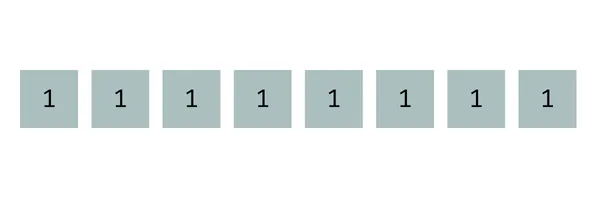

# 鲜为人知的内置序列—Bytes

> https://www.thepythoncodingstack.com/p/bytes-python-built-in-unicode-utf-8-encoding

## 一、Bytes v.s. 字符串

​	如果我让你说出一个内置的不可变序列，你可能会建议一个元组或一个字符串。但还有另一个：`bytes`。

​	首先，让我们关注一下称为的数据类型`bytes`。最好的解释方式`bytes`是将其与字符串进行比较。让我们创建一个字符串和一个对象，通过添加了后缀，以明确它与字符串的区别：

```python
>>> text = "Hello"
>>> text_bytes = b"Hello"
```

### 1. display

​	字面上，两者看起来与字符串非常相似。在引号前面添加`b`。我们较为熟悉的是在单引号或双引号（或三引号）前面添加`f`来创建format字符串。但这不同，F字符串仍然是字符串。但上述用法会创建一个具有不同数据类型的对象。

```python
>>> type(text)
<class 'str'>
>>> type(text_bytes)
<class 'bytes'>
```

​	并且当我们打印这些字符串和`bytes`对象时，它们看起来也很相似：

```python
>>> text
'Hello'
>>> text_bytes
b'Hello'
```

​	看起来，似乎只有引号前面的显示有所不同。

### 2. Sequence

​	它们都是序列，因此，您可以使用以下方法找到它们的长度`len()`：

```python
>>> len(text)
5
>>> len(text_bytes)
5
```

​	在这种情况下，它们的长度相同。

- 那么，让我们看看它们的区别。它们都是序列，因此您可以使用方括号表示法来访问每个对象中的第一个元素：

  ```python
  >>> text[0]
  'H'
  >>> text_bytes[0]
  72
  ```

  ​	字符串中的`text`的第0个元素是单字母字符串`H`。但对象`text_bytes`中的第一个元素是整数 72

  - 可以通过将对象转换为列表来单独查看所有元素：

    ```python
    >>> list(text)
    ['H', 'e', 'l', 'l', 'o']
    >>> list(text_bytes)
    [72, 101, 108, 108, 111]
    ```

### 3. What‘s in bytes

​	对象`bytes`是整数的不可变序列。但并非是任意整数。对象中的元素`bytes`是 0 到 255 范围内的整数。这些数字可以用八位表示，其中每位为 0 或 1。最大的 8 位数是二进制中有八个 1 的数字：

```python
>>> 0b11111111
255
```

​	该数字`0b11111111`是一个二进制数，如开头所示`0b`。它有 8 位全为 1，相当于十进制的 255。让我们在图像中显示这 8 位：



​	八位为一个字节。因此，`bytes`对象中的每个元素代表一个 0 到 255 之间的整数，即 8 位数字，即一个字节。每个元素代表一个字节的数据。


## 二、ASCII码

> 查看ASCII码对应的表示：https://en.wikipedia.org/wiki/ASCII#Printable_characters

​	那么，将字符串转换为`bytes`对象时得到的数字是什么？它们是 ASCII 字符代码。

​	大写字母H的 ASCII 码为 72。小写字母e的ASCII码为 101。原始字符串中的每个字符都转换为其 ASCII 码。ASCII 是一种 7 位编码，因此，它包含 128 个字符($2^7 = 128$)，但并非所有字符都是可打印字符,一些 ASCII 码现已过时。

​	由于 ASCII 字符只有 128 个，其代码范围从 0 到 127，因此它们都适合一个字节的数据（有八位）。

​	可打印的 ASCII 字符包括：

- 基本标点符号

- 0 至 9 的数字

- 英文字母中的大写和小写拉丁字母

  这非常有，我们需要许多其他字符来表示现代和国际文本。例如，中文`你好，朋友`。

## 三、UTF-8

​	[Unicode](https://en.wikipedia.org/wiki/Unicode)是用于表示更广泛字符集的标准。目前，它包含近 150,000 个字符！前 128 个 Unicode 字符与 ASCII 字符匹配。但我们如何表示剩余的字符？如果只能用单个字节表示，则只剩下 128 个数字（128-255），显然不满足我们的需求，所以我们需要更多字节。我们需要找到一种使用一个或多个字节来表示 Unicode 代码的方法。	

### 1. Unicode

- Unicode 字符最常见的编码是UTF-8。

  ​	让我们将一些包含非 ASCII 字符的字符串转换为`bytes`时使用 UTF-8 编码。您不能使用`bytes`将文字（将`b`放在引号前面）与非 ASCII 字符一起使用，否则会提示语法错误：

  ```python
  >>> text_bytes = b"你好"
    File "<stdin>", line 1
  SyntaxError: bytes can only contain ASCII literal characters.
  
  ```
  ​	您可以使用`bytes()`构造函数或字符串方法`.encode()`。两者均返回相同的`bytes`对象。本例中的调用均将编码`"utf-8"`作为参数包含在内。但是，`.encode()`如果您想使用 UTF-8（默认设置），则该方法不需要编码参数。字符串方法提供了更大的灵活性，因此它是首选。

  ```python
  >>> text_bytes = bytes("你好world", "utf-8")
  >>> "你好world".encode("utf-8")
  b'\xe4\xbd\xa0\xe5\xa5\xbdworld'
  >>> text_bytes
  b'\xe4\xbd\xa0\xe5\xa5\xbdworld'
  ```

  ​	可以看到，`world`是ASCII 字符，因此直接显示。但是，关于中文的显示为字节形式，总长度为11，除去ASCII字符的5个ASCII码，剩余6个字节用来表示中文。

  ```
  >>> len(text_bytes)
  13
  ```

  ​	我们可以猜测`\xe4\xbd\xa0`表示中文"你"，`\xe5\xa5\xbd`表示中文"好"。

### 2. UTF-8编码规则

​	关于`\xe4\xbd\xa0`，第一个字节`\xe4`表示为十六进制，对应十进制中的228。

```python
>>> int("e4", 16)
228
>>> bin(228)
'0b11100100'
```

​	转换为2进制的表示为"11100100"。

​	以下是如何理解 UTF-8 编码数字中的字节。从最高位开始查找第一个 0 值：对于上述示例而言，第一个0值出现在index=3的位置。

​	直到第一个 0 为止的位**包含有关此字节在组成字符的字节集中的角色的信息**，对应于`1110`。第一个 0 前面有三个 1。这个 1110 模式表示此字节是三个字节组合中的第一个字节，这三个字节组合在一起表示一个 Unicode 字符。总而言之，这个 8 位二进制数的起始 1110 模式告诉我们以下内容：

1. 这是代表单个字符的一组字节中的第一个。

2. 这组字节有三个字节。

   让我们看看第二个字节，十六进制为`\xbd`，十进制为 。以下是二进制表示的数字：

```python
>>> int("bd", 16)
189
>>> bin(189)
'0b10111101'
```

​	查找第一个0出现的位置，index=1，`10`模式表明该字节不是新字符的开始，而是连续的。它是一组字节的一部分，但不是该组中的第一个字节。我们已经知道这组字节以前一个字节开始，该字节的值为228。

​	让我们看看第三个字节，十六进制为`\xa0`，十进制为160 。以下是二进制表示的数字：

```python
>>> int("a0", 16)
160
>>> bin(160)
'0b10100000'
```

​	没错，三个字节中的每个字节中的一些位都为我们提供了有关如何将字节组合在一起的信息。到目前为止，我们知道这三个字节一起代表单个字符。

​	但是我们怎样才能知道这是什么字符呢？

​	让我们看看每个字节的剩余位，我在下图中使用橙色表示。这些位携带有关字符本身的数据：


​	

​	当您将所有三个字节中的数据位（以橙色显示）组合在一起时，您会得到以下内容：

```python
>>> 0b0100111101100000
20320
>>> chr(20320)
'你'
```


​	