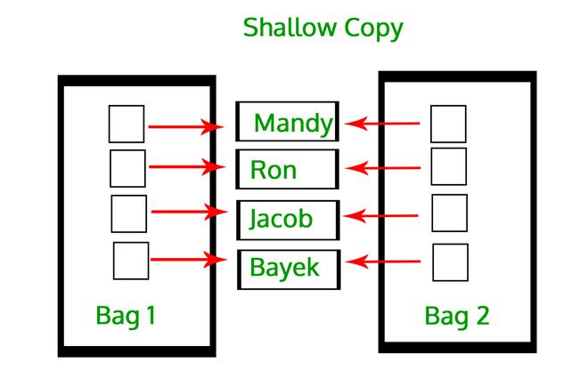
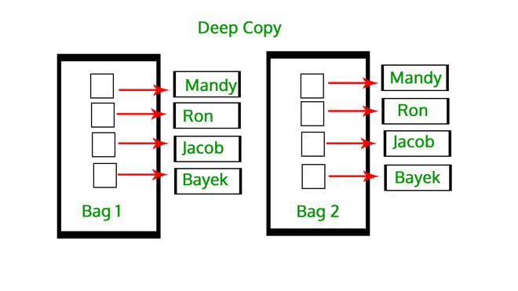

# Copy

## 1. 浅拷贝

​     不会复制原始对象的索引和数据，而只是复制对其索引和数据的引用。因此，对一个所做的更改会反映在另一个中。它指的是构造一个新的集合对象，然后使用对在原始对象中找到的子对象的引用来填充它。复制过程不会递归，因此不会创建子对象本身的副本。



`copy.copy()`返回浅拷贝。

## 2. 深拷贝

​	Series 或 Series 对象的深层副本具有自己的索引和数据副本。这是一个复制过程递归发生的过程。这意味着首先构造一个新的集合对象，然后用在原始对象中找到的子对象的副本递归地填充它。在深拷贝的情况下，一个对象的副本被复制到另一个对象中。这意味着对对象副本所做的任何更改都不会反映在原始对象中。



`copy.deepcopy()`返回深拷贝。

如果原始对象的数据内部的数据仍然指向同一个内存单元。例如，如果 Series 对象中的数据包含任何可变数据，那么它将在它和它的深层副本之间共享，并且对一个的任何修改都将反映在另一个中。 浅拷贝和深拷贝之间的区别仅与复合对象（包含其他对象的对象，如列表或类实例）有关。

|      | Shallow                                                      | Deep                                                         |
| ---- | ------------------------------------------------------------ | ------------------------------------------------------------ |
| 1    | 集合结构副本，不复制子对象                                   | 集合结构副本，递归复制子对象                                 |
| 2    | 复制后依赖于原对象                                           | 复制后不依赖原对象                                           |
| 3    | 创建速度快                                                   | 创建速度慢                                                   |
|      | 浅拷贝构造一个新的复合对象，然后（在可能的范围内）向其中插入对原始对象中找到的对象的引用。 | 深拷贝构造一个新的复合对象，然后递归地将在原始对象中找到的对象的副本插入其中。 |

	使用pandas对象的`copy()`方法和`copy.deepcopy()`方法。

```python
>>> import pandas as pd
>>> import numpy as np
>>> import copy
>>> data = pd.DataFrame({"A":np.arange(1, 6), "B":np.random.randint(0, 5, size=5)})
>>> data
   A  B
0  1  4
1  2  2
2  3  3
3  4  1
4  5  3
>>> data_new = data.copy()
>>> data_new
   A  B
0  1  4
1  2  2
2  3  3
3  4  1
4  5  3
>>> data_new.loc[2][1] = 100
>>> data_new
   A    B
0  1    4
1  2    2
2  3  100
3  4    1
4  5    3
>>> data
   A  B
0  1  4
1  2  2
2  3  3
3  4  1
4  5  3
```

	发现两者的表现似乎是一致的，但是有时使用copy方法进行的是浅拷贝，而有时是深拷贝。两者作为对象复制方法到底有何区别？查阅`pandas.DataFrame.copy()`官方文档：

```python
    def copy(self: NDFrameT, deep: bool_t = True) -> NDFrameT:
        """
        Make a copy of this object's indices and data.

        When ``deep=True`` (default), a new object will be created with a
        copy of the calling object's data and indices. Modifications to
        the data or indices of the copy will not be reflected in the
        original object (see notes below).

        When ``deep=False``, a new object will be created without copying
        the calling object's data or index (only references to the data
        and index are copied). Any changes to the data of the original
        will be reflected in the shallow copy (and vice versa).

        Parameters
        ----------
        deep : bool, default True
            Make a deep copy, including a copy of the data and the indices.
            With ``deep=False`` neither the indices nor the data are copied.

        Returns
        -------
        copy : Series or DataFrame
            Object type matches caller.

        Notes
        -----
        When ``deep=True``, data is copied but actual Python objects
        will not be copied recursively, only the reference to the object.
        This is in contrast to `copy.deepcopy` in the Standard Library,
        which recursively copies object data (see examples below).

        While ``Index`` objects are copied when ``deep=True``, the underlying
        numpy array is not copied for performance reasons. Since ``Index`` is
        immutable, the underlying data can be safely shared and a copy
        is not needed.
```

- Pandas.DataFrame.copy

  - 当`deep=True`时，默认也为True(将进行深拷贝)。将拷贝原始对象的数据和索引到一个新对象中，对于该副本对象的数据进行修改，将不会影响原对象中的数据。

    - 数据被复制但实际的 Python 对象将不会被递归复制，只会复制对象的引用。这与标准库中的 copy.deepcopy 形成对比，后者递归地复制对象数据。

    - 虽然在 ``deep=True`` 时复制 ``Index`` 对象，但出于性能原因不会复制底层的 numpy 数组。 由于 ``Index`` 是不可变的，因此可以安全地共享底层数据并且不需要副本。

    - 请注意，<font color='red'>当复制包含 Python 对象的对象时，深拷贝将复制数据，但不会递归地这样做。 更新嵌套数据对象将反映在深拷贝中。</font>

      ```python
      # 发现这里好像不太一样
      >>> s = pd.Series([[1, 2], [3, 4]])
      >>> deep = s.copy()
      >>> s[0][0] = 10
      >>> s
      0    [10, 2]
      1     [3, 4]
      dtype: object
      >>> deep
      0    [10, 2]
      1     [3, 4]
      dtype: object
      >>> deep.index is s.index
      False
      >>> deep.values is s.values
      False
      >>> s[0] is deep[0]
      True
      
      #--------------------------
      # 发现，这样居然不会影响deep的到的数据
      >>> s = pd.Series([1, 2], index=["a", "b"])
      >>> s
      a    1
      b    2
      dtype: int64
      >>> shallow = s.copy(deep=False)
      >>> deep = s.copy(deep=True)
      >>> deep is s
      False
      >>> shallow is s
      False
      >>> deep.index is s.index or deep.values is s.values
      False
      >>> shallow.index is s.index or shallow.values is s.values
      True
      >>> s[0] = 3
      >>> s
      a    3
      b    2
      dtype: int64
      >>> shallow
      a    3
      b    2
      dtype: int64
      >>> deep
      a    1
      b    2
      dtype: int64
      
      #--------------------------
      >>> data = pd.DataFrame({"A":[1, 2, 3], "B":[0,0,0]})
      >>> data
         A  B
      0  1  0
      1  2  0
      2  3  0
      >>> data_new = data.copy()
      >>> data_new
         A  B
      0  1  0
      1  2  0
      2  3  0
      >>> data_new.loc[1][1] = 100
      >>> data_new
         A    B
      0  1    0
      1  2  100
      2  3    0
      >>> data
         A  B
      0  1  0
      1  2  0
      2  3  0
      ```

      > 这里就出现了和上面不太相同的现象，这里对原始数据的修改，会体现在深拷贝对象中。Why?
      >
      > 当复制包含 Python 对象的对象时，深拷贝将复制数据，但不会递归地这样做。更新嵌套数据对象将反映在深拷贝中。
      >
      > ```python
      > >>> data = pd.DataFrame([[1,2], [3, 4]])
      > >>> data_df_cp = data.copy()
      > >>> data
      > 0  1
      > 0  1  2
      > 1  3  4
      > >>> data_df_cp
      > 0  1
      > 0  1  2
      > 1  3  4
      > >>> data_df_cp[0] is data[0]
      > False
      > 
      > >>> data[1][1] = 1000
      > >>> data
      > 0     1
      > 0  1     2
      > 1  3  1000
      > >>> data_df_cp
      > 0  1
      > 0  1  2
      > 1  3  4
      > ```
      >
      > 居然没有影响，so puzzled～

  - 当`deep=False`时，将创建一个新对象而不复制该对象的数据或索引（仅复制对数据和索引的引用）。 对原始数据的任何更改都将反映在浅拷贝中（反之亦然）。

  ```python
  >>> s = pd.Series([1, 2], index=["a", "b"])
  >>> deep = s.copy()
  >>> shallow = s.copy(deep=False)
  >>> s is shallow
  False
  >>> s.values is shallow.values 
  True
  >>> s.index is shallow.index
  True
  >>> s.values is deep.values
  False
  ```

  	可以看到，浅拷贝得到的是原始数据的引用（浅拷贝与原始共享数据和索引），而深拷贝得到的是原始数据和索引的副本。
  	
  	shallow copy和 original共享数据的更新在两者中都有体现。

  

- copy.deepcopy()

   **深拷贝**在复制过程中使用递归。这意味着首先构造一个新的集合对象，然后用在原始对象中找到的子对象的副本递归地填充它。以这种方式复制对象会遍历整个对象树，以创建原始对象及其所有子对象的完全独立的克隆。

 

- 为什么有时候会很混乱？是因为嵌套拷贝的存在

  ```python
  
  >>> df1 = pd.DataFrame({'A':[[1,2],[3,4],[5,6]],'B':[[7,8],[9,10],[11,12]]})
  >>> df1
          A         B
  0  [1, 2]    [7, 8]
  1  [3, 4]   [9, 10]
  2  [5, 6]  [11, 12]
  >>> df2 = df1.copy(deep=True)
  >>> df3 = copy.deepcopy(df1)
  
  >>> df1.iloc[0,0][0] = 999
  
  >>> df1
            A         B
  0  [999, 2]    [7, 8]
  1    [3, 4]   [9, 10]
  2    [5, 6]  [11, 12]
  
  >>> df2
            A         B
  0  [999, 2]    [7, 8]
  1    [3, 4]   [9, 10]
  2    [5, 6]  [11, 12]
  
  >>> df3
            A         B
  0  [999, 2]    [7, 8]
  1    [3, 4]   [9, 10]
  2    [5, 6]  [11, 12]
  ```

  ​	咦，居然都改变了。因为我仅仅对dataframe进行了深拷贝，因此我得到了一个新的dataframe，该dataframe和原来的dataframe一样，每个元素存储的都是list的引用。注意是list的引用而不是list，因此我实际上是深拷贝了list的引用，但是并不是把里面的数据都拷贝了一遍。当我修改原数据中的list中的元素时，我是真正的改掉了list中的元素，因此原来的dataframe和深拷贝的dataframe中的每个元素的引用中的元素都被改掉了，这就是出现令人混乱的现象的原因。